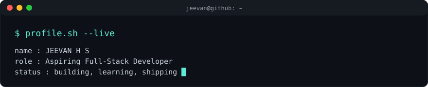
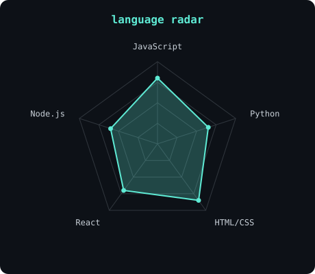

  
   
  

  
  
  

  

---

## This is me :)

Hi, I'm **Jeevan**, a final-year Information Science and Engineering student from Karnataka, India 🇮🇳.
I love turning ideas into real, working applications, and I'm always looking for the next problem to solve with code.

- 🎓 **Final-year Information Science & Engineering student**, growing into a full-stack developer.
- 🚀 **Building** responsive websites, browser games and mobile apps with JavaScript, React and Node.js.
- 🧠 **Currently levelling up** in Data Structures & Algorithms, modern web technologies and open source.
- 👥 **Open to collaborate** on web development and open-source projects.
- 💬 **Ask me about** JavaScript, Python, React.js and web development.
- 🌱 **My mission:** keep learning, keep shipping, and turn every idea into something people can actually use.

## my perfect stack

  

---

## signals

|  |  |
| --- | --- |

---

## selected builds

| Project | What it is | Stack |
| --- | --- | --- |
| 🛒 [**E-Commerce Website**](https://github.com/jeevanhs821/ecommerce-site) | Online shopping platform with a responsive, modern UI. | HTML, CSS, JavaScript |
| 🎮 [**Space Escape Runner**](https://github.com/jeevanhs821/Space-Escape-Runner) | Browser-based game with interactive gameplay and animations. | HTML, CSS, JavaScript |
| 🚀 [**Space Escape Runner (Mobile)**](https://github.com/jeevanhs821/Space-Escape-Runner-) | 2D arcade mobile game: dodge falling asteroids with left/right controls. | React Native, Expo |
| 🌐 **Portfolio Website** | Personal site showcasing skills, projects and my technical journey. | HTML, CSS, JavaScript |

## currently learning

`JavaScript (ES6+)` · `Python` · `React.js` · `Node.js` · `Express.js` · `MongoDB` · `DSA` · `Git & GitHub`

---

## Numbers matter? ohhh yes.

  
  

---

<code>Built with love · @jeevanhs821</code>

